# Mermaid Architecture Freeform

These diagrams are practice fixtures for manual architecture layout. The goal is
to place services wherever the explanation wants them, then route the wiring
with `points` or `bend_points`.

The important trick is that the nudge lives next to the diagram text. The user
can keep Mermaid's automatic layout for most objects, then add one annotation
line when a service, group, or connection needs to land somewhere specific.
For connection labels, `label_offset` nudges from the route midpoint and
`label_pos` pins the label center exactly.

## Corridor routing

```mermaid
architecture-beta
title Corridor Routing
group clients(cloud)[Clients]
group app(service)[Application]
group data(disk)[Storage]

service entry(browser)[Browser] in clients
service gateway(gateway)[Gateway] in app
service auth(lock)[Auth] in app
service api(api)[API] in app
service cache(cache)[Cache] in data
service db(database)[Database] in data

entry:R -[request]-> L:gateway
gateway:R -[route]-> L:api
auth:R -[grant]-> L:api
gateway:B -[challenge]-> T:auth
api:R -[warm]-> L:cache
api:R -[read]-> L:db

%% @service entry x=48 y=186 w=112 h=92
%% @service gateway x=280 y=70 w=112 h=92
%% @service auth x=280 y=252 w=112 h=92
%% @service api x=462 y=161 w=112 h=92
%% @service cache x=660 y=70 w=112 h=92
%% @service db x=660 y=252 w=112 h=92
%% @group clients x=28 y=150 w=154 h=170
%% @group app x=250 y=36 w=352 h=344
%% @group data x=632 y=36 w=166 h=344
%% @edge entry->gateway points="160,232 206,232 206,116 280,116"
%% @edge gateway->api points="392,116 426,116 426,207 462,207"
%% @edge auth->api points="392,298 426,298 426,207 462,207"
%% @edge gateway->auth points="336,162 336,252"
%% @edge api->cache points="574,207 616,207 616,116 660,116"
%% @edge api->db points="574,207 616,207 616,298 660,298"
%% @graph w=840 h=420
```

## Message lanes

```mermaid
architecture-beta
title Message Lanes
group producers(cloud)[Producers]
group stream(queue)[Stream]
group consumers(service)[Consumers]
group stores(disk)[Stores]

service web(browser)[Web App] in producers
service mobile(mobile)[Mobile App] in producers
service ingress(gateway)[Ingress] in stream
service bus(queue)[Event Bus] in stream
service worker(worker)[Worker] in consumers
service function(function)[Function] in consumers
service log(file)[Log File] in stores
service warehouse(database)[Warehouse] in stores

web:R -[event]-> L:ingress
mobile:R -[event]-> L:ingress
ingress:R -[publish]-> L:bus
bus:R -[deliver]-> L:worker
bus:R -[trigger]-> L:function
worker:R -[append]-> L:log
function:R -[load]-> L:warehouse

%% @service web x=52 y=86 w=112 h=92
%% @service mobile x=52 y=250 w=112 h=92
%% @service ingress x=260 y=168 w=112 h=92
%% @service bus x=430 y=168 w=112 h=92
%% @service worker x=640 y=86 w=112 h=92
%% @service function x=640 y=250 w=112 h=92
%% @service log x=828 y=86 w=112 h=92
%% @service warehouse x=828 y=250 w=112 h=92
%% @group producers x=28 y=52 w=160 h=326
%% @group stream x=236 y=132 w=330 h=164
%% @group consumers x=616 y=52 w=160 h=326
%% @group stores x=804 y=52 w=160 h=326
%% @edge web->ingress points="164,132 214,132 214,214 260,214"
%% @edge mobile->ingress points="164,296 214,296 214,214 260,214"
%% @edge ingress->bus points="372,214 430,214"
%% @edge bus->worker points="542,214 594,214 594,132 640,132"
%% @edge bus->function points="542,214 594,214 594,296 640,296"
%% @edge worker->log points="752,132 828,132"
%% @edge function->warehouse points="752,296 828,296"
%% @graph w=1000 h=420
```

## Crossing control

```mermaid
architecture-beta
title Crossing Control
group left(cloud)[Input Side]
group center(service)[Control Plane]
group right(disk)[Output Side]

service client(browser)[Client] in left
service agent(worker)[Agent] in left
service router(gateway)[Router] in center
service policy(lock)[Policy] in center
service api(api)[API] in center
service cache(cache)[Cache] in right
service db(database)[Database] in right

client:R -[call]-> L:router
agent:R -[report]-> L:api
router:B -[check]-> T:policy
policy:B -[allow]-> T:api
api:R -[cache]-> L:cache
api:R -[write]-> L:db
router:R -[direct]-> L:db

%% @service client x=56 y=88 w=116 h=94
%% @service agent x=56 y=274 w=116 h=94
%% @service router x=305 y=78 w=116 h=94
%% @service policy x=305 y=218 w=116 h=94
%% @service api x=305 y=358 w=116 h=94
%% @service cache x=620 y=88 w=116 h=94
%% @service db x=620 y=274 w=116 h=94
%% @group left x=30 y=48 w=170 h=352
%% @group center x=278 y=40 w=172 h=444
%% @group right x=592 y=48 w=172 h=352
%% @edge client->router points="172,135 250,135 250,125 305,125"
%% @edge agent->api points="172,321 250,321 250,405 305,405"
%% @edge router->policy points="363,172 363,218"
%% @edge policy->api points="363,312 363,358"
%% @edge api->cache bend_points="500,405 500,135"
%% @edge api->db bend_points="520,405 520,321"
%% @edge router->db bend_points="548,125 548,321"
%% @graph w=820 h=520
```

## Bend point anchors

```mermaid
architecture-beta
title Bend Point Anchors
group origin(cloud)[Origin]
group control(service)[Control]
group targets(disk)[Targets]

service source(browser)[Source] in origin
service router(gateway)[Router] in control
service rules(lock)[Rules] in control
service primary(database)[Primary] in targets
service audit(document)[Audit] in targets

source:R -[enter]-> L:router
router:B -[check]-> T:rules
rules:R -[allow]-> L:primary
router:R -[record]-> L:audit

%% @service source x=60 y=170 w=116 h=94
%% @service router x=330 y=92 w=116 h=94
%% @service rules x=330 y=276 w=116 h=94
%% @service primary x=650 y=92 w=116 h=94
%% @service audit x=650 y=276 w=116 h=94
%% @group origin x=34 y=124 w=170 h=190
%% @group control x=302 y=52 w=174 h=360
%% @group targets x=622 y=52 w=174 h=360
%% @edge source->router bend_points="236,217 236,139"
%% @edge router->rules bend_points="388,214"
%% @edge rules->primary bend_points="520,323 520,190 650,190" label_pos="565,190"
%% @edge router->audit bend_points="590,139 590,323" label_offset="22,0"
%% @graph w=840 h=460
```

