# Mermaid Architecture Glyphs

This page is a visual fixture for the bundled architecture glyph shapes. Each
service icon resolves through the same `.shape` registry that doc sets can
override from `docs/.shapes/`.

## Clients and edge

```mermaid
architecture-beta
title Client and Edge Glyphs
group clients(cloud)[Clients]
group edge(cloud)[Edge]

service user(user)[User] in clients
service browser(browser)[Browser] in clients
service mobile(mobile)[Mobile App] in clients
service internet(internet)[Internet] in edge
service cloud(cloud)[Cloud] in edge
service gateway(gateway)[Gateway] in edge
service lock(lock)[Lock] in edge

user:R -[opens]-> L:browser
mobile:R -[syncs]-> L:internet
browser:R -[calls]-> L:internet
internet:R -[fronts]-> L:cloud
cloud:R -[routes]-> L:gateway
gateway:B -[checks]-> T:lock
```

## Runtime

## Data and documents

```mermaid
architecture-beta
title Data Glyphs
group data(disk)[Data]

service cache(cache)[Cache] in data
service database(database)[Database] in data
service db(db)[DB Alias] in data
service disk(disk)[Disk] in data
service file(file)[File] in data
service document(document)[Document] in data

cache:R -[miss]-> L:database
database:R -[alias]-> L:db
database:B -[stores]-> T:disk
disk:R -[contains]-> L:file
file:R -[renders]-> L:document
```

