# Mermaid Architecture Patterns

These examples use the bundled architecture glyphs in realistic documentation
scenarios. They are intentionally small enough to work as screenshot fixtures.

## Fast local viewer

```mermaid
architecture-beta
title Fast Local Markdown Viewer
group docs(disk)[Doc Set]
group app(service)[DocCrate]
group win(server)[Windows]

service files(file)[MD Files] in docs
service shapes(document)[Shapes] in docs
service rope(cache)[Rope Buffer] in app
service parser(function)[Parser] in app
service layout(service)[Layout] in app
service charts(api)[Mermaid IR] in app
service d2d(server)[D2D] in win
service window(browser)[Window] in win

files:R -[loads]-> L:rope
rope:R -[blocks]-> L:parser
parser:R -[flows]-> L:layout
layout:B -[charts]-> T:charts
shapes:R -[overrides]-> L:charts
charts:R -[paths]-> L:d2d
d2d:R -[paints]-> L:window
```

## Heading search

```mermaid
architecture-beta
title Heading Search Path
group source(disk)[Source]
group index(cache)[Index]
group ui(browser)[Viewer]

service files(file)[Markdown Files] in source
service rope(cache)[Large File Rope] in source
service scanner(worker)[Heading Scanner] in index
service map(database)[Heading Map] in index
service find(api)[Find Command] in ui
service jump(document)[Jump Target] in ui

files:R -[streams]-> L:rope
rope:R -[lines]-> L:scanner
scanner:R -[stores]-> L:map
find:B -[queries]-> T:map
map:R -[returns]-> L:jump
```

## Screenshot review

```mermaid
architecture-beta
title Screenshot Review Loop
group input(disk)[Inputs]
group app(service)[DocCrate]
group output(document)[Artifacts]

service fixture(file)[Fixture Doc] in input
service line(function)[Scroll Line] in input
service runner(worker)[Test Snap Runner] in app
service renderer(server)[Renderer] in app
service png(file)[Screen PNG] in output
service reviewer(user)[Reviewer] in output

fixture:R -[opens]-> L:runner
line:R -[positions]-> L:runner
runner:R -[draws]-> L:renderer
renderer:R -[writes]-> L:png
png:R -[inspect]-> L:reviewer
```

## Shape override flow

```mermaid
architecture-beta
title Shape Override Resolution
group bundled(disk)[Bundled]
group docs(disk)[Doc Set]
group renderer(service)[Renderer]

service builtins(file)[Bundled Shapes] in bundled
service overrides(file)[Doc Shapes] in docs
service chart(document)[Mermaid Block] in docs
service registry(cache)[Shape Registry] in renderer
service geometry(function)[Geometry Builder] in renderer
service target(server)[Direct2D Target] in renderer

builtins:R -[loads first]-> L:registry
overrides:R -[replaces]-> L:registry
chart:R -[icon name]-> L:registry
registry:R -[shape def]-> L:geometry
geometry:R -[path]-> L:target
```

