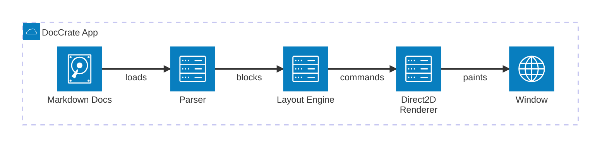

# Mermaid Architecture

DocCrate renders Mermaid `architecture-beta` blocks natively. They are useful
for service maps, deployment notes, operational runbooks, and diagrams that show
which local components talk to which infrastructure services.

Service icons resolve through DocCrate's `.shape` registry, so bundled glyphs
such as `server`, `database`, `queue`, and `disk` can be replaced globally from
`docs/.shapes/`.

A service map with storage and background work:

```mermaid
architecture-beta
title Documentation Portal Services
group edge(cloud)[Edge]
group core(cloud)[Core Services]
group data(disk)[Data]

service browser(internet)[Browser] in edge
service gateway(server)[Gateway] in edge
service api(server)[Docs API] in core
service worker(server)[Index Worker] in core
service queue(queue)[Job Queue] in core
service db(database)[Metadata DB] in data
service files(disk)[Markdown Files] in data

browser:R -[requests]-> L:gateway
gateway:R -[routes]-> L:api
api:B -[reads]-> T:db
api:B -[loads]-> T:files
api:R -[enqueues]-> L:queue
queue:R -[drives]-> L:worker
worker:B -[updates]-> T:db
```

Manual layout comments can take over only the pieces that need human control.
Use `@service` or `@group` for `x`, `y`, `w`, and `h`; use `@edge` with
`points` for a complete route or `bend_points` to keep automatic endpoints and
insert manual bends. Edge labels can be nudged with `label_offset` or placed
directly with `label_pos`.

```mermaid
architecture-beta
title Manual Architecture Layout
group clients(cloud)[Clients]
group app(service)[App]
group data(disk)[Data]

service browser(browser)[Browser] in clients
service gateway(gateway)[Gateway] in app
service api(api)[API] in app
service worker(worker)[Worker] in app
service queue(queue)[Queue] in app
service db(database)[Database] in data

browser:R -[request]-> L:gateway
gateway:R -[route]-> L:api
api:B -[enqueue]-> T:queue
queue:B -[drive]-> T:worker
api:R -[read]-> L:db
worker:R -[update]-> L:db

%% @service browser x=50 y=135 w=118 h=104
%% @service gateway x=245 y=86 w=118 h=104
%% @service api x=245 y=235 w=118 h=104
%% @service queue x=432 y=86 w=118 h=104
%% @service worker x=432 y=235 w=118 h=104
%% @service db x=635 y=160 w=118 h=104
%% @group clients x=28 y=86 w=164 h=214
%% @group app x=222 y=42 w=356 h=340
%% @group data x=612 y=110 w=164 h=214
%% @edge browser->gateway points="168,187 205,187 205,138 245,138"
%% @edge gateway->api points="304,190 304,235"
%% @edge api->queue bend_points="400,287 400,138" label_offset="0,-14"
%% @edge queue->worker points="491,190 491,235"
%% @edge api->db points="363,287 500,287 500,212 635,212"
%% @edge worker->db points="550,287 595,287 595,212 635,212"
%% @graph w=820 h=420
```

