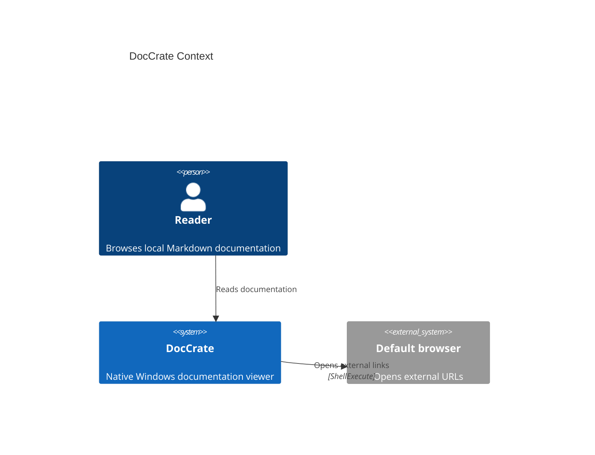
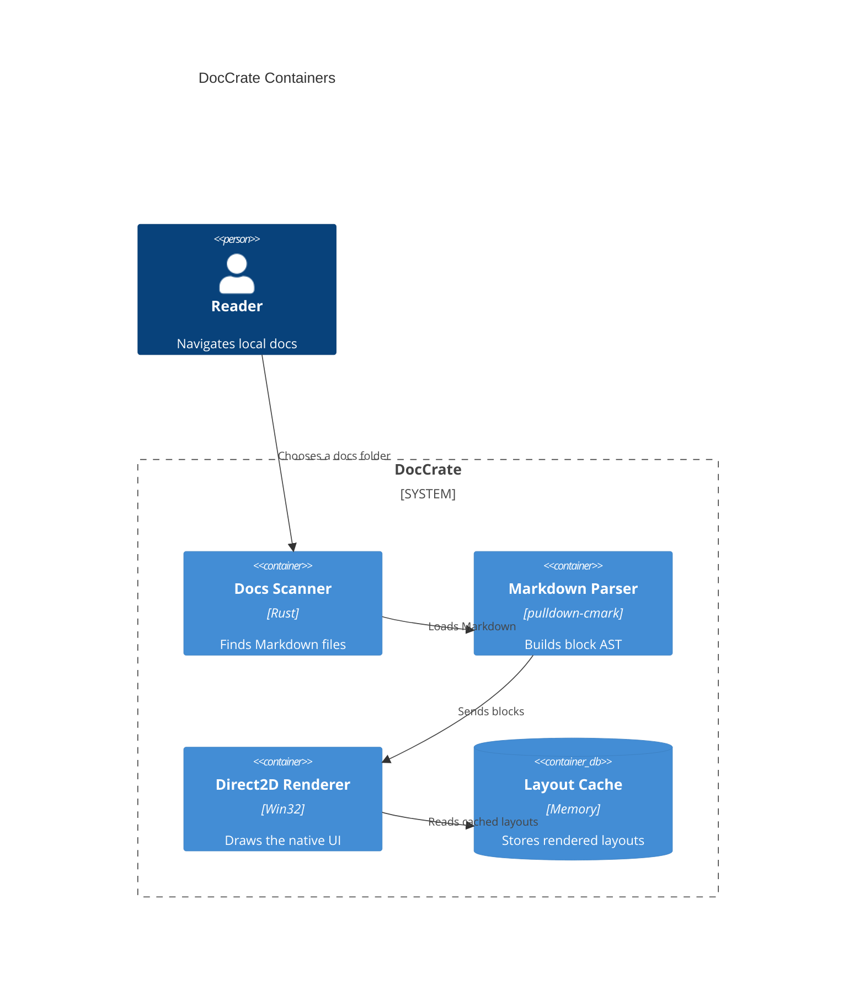
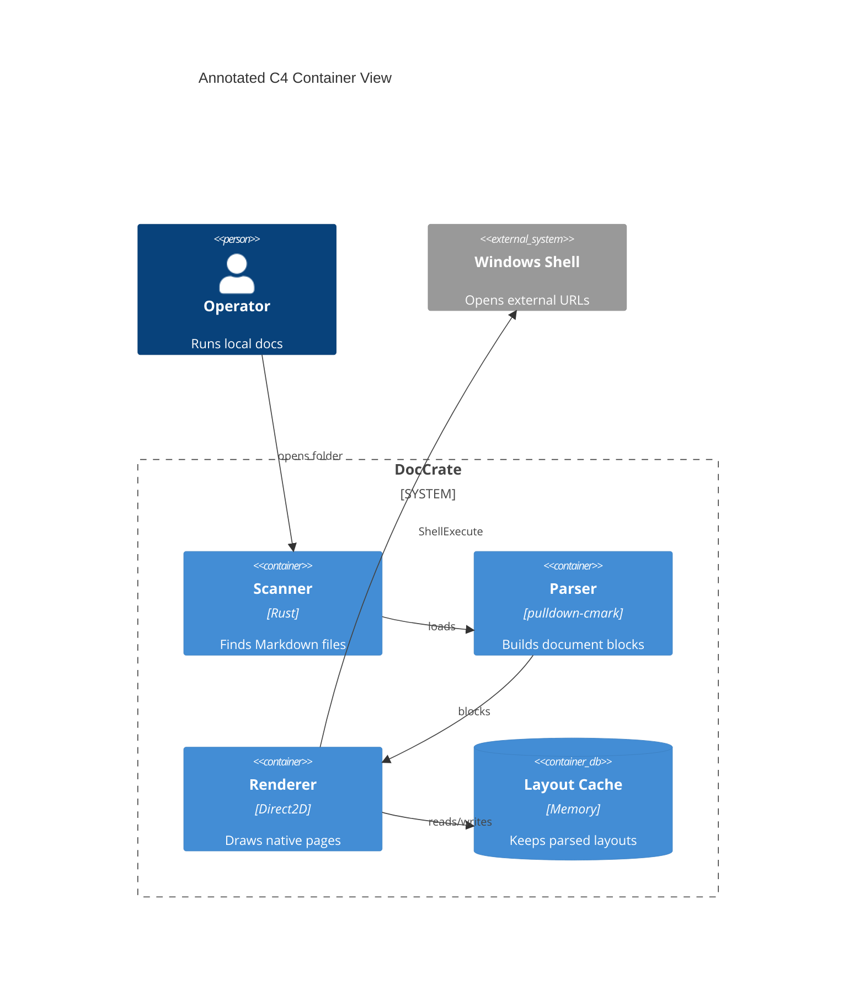
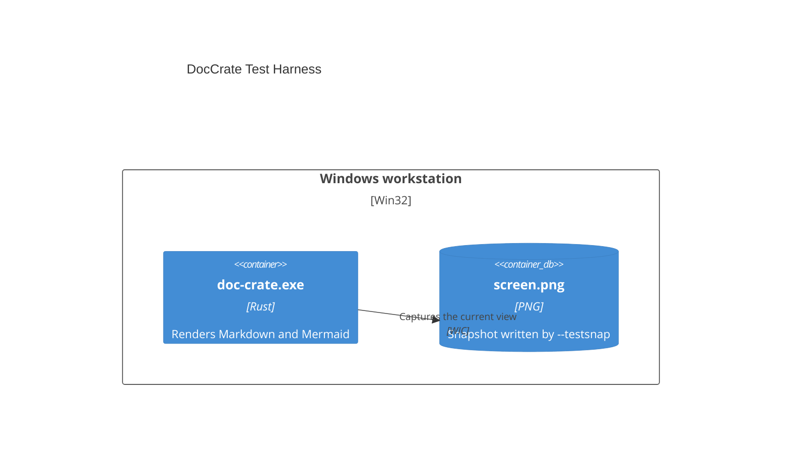

# Mermaid C4 Diagrams

DocCrate renders Mermaid C4 diagrams natively. They are useful for context,
container, component, and deployment views in software architecture docs.

A container view with boundaries, relationship labels, and database shapes:

## Manual C4 Layout

Comment annotations can take over C4 placement when a diagram needs a more
deliberate presentation. Use `@node` for elements, `@group` for boundaries,
`@edge` for relationship routing or label placement, and `@graph` for the
canvas.

Deployment nodes use a solid boundary:

