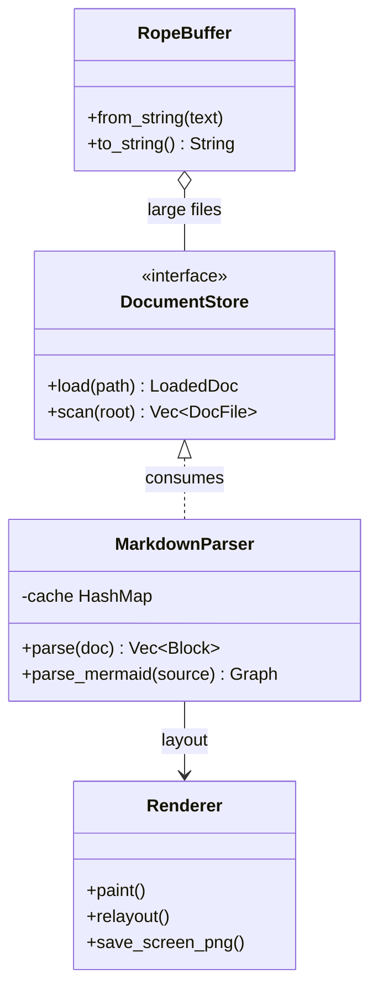
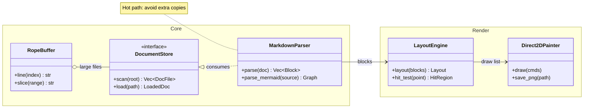
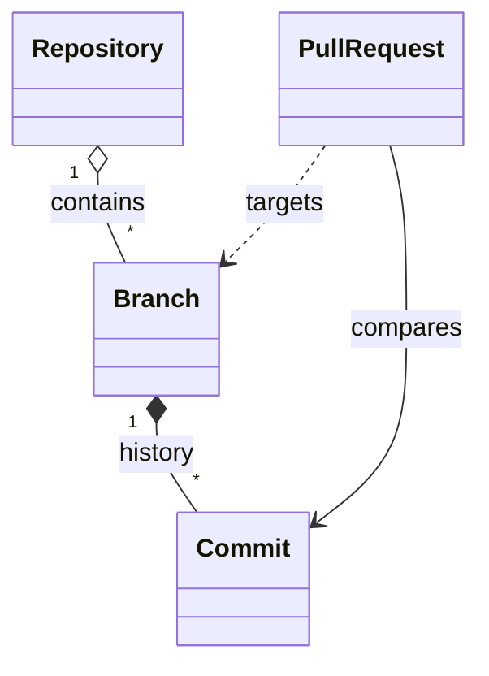

# Mermaid Class Diagrams

DocCrate renders Mermaid `classDiagram` blocks natively. They are useful for
API contracts, trait/interface sketches, domain models, and implementation
relationships that should stay close to the documentation.

## Manual Class Layout

Manual comments can place classes, namespace groups, attached notes, and
relationship routes when the automatic layout needs author control. Attached
notes can be targeted as `note:ClassName`.

Cardinality and relation markers are supported too:

