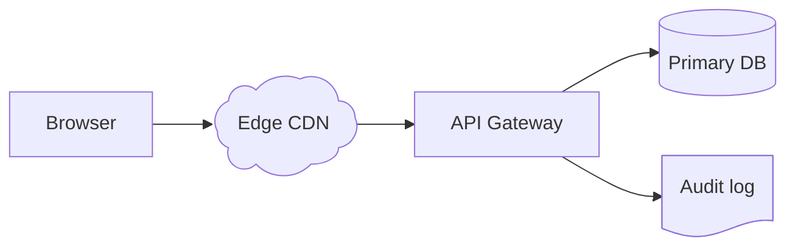
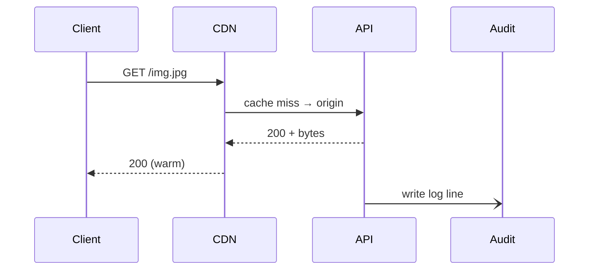

# Custom Shapes

DocCrate ships with the classic mermaid shape catalog (rectangle, diamond,
cylinder, …) baked into the renderer. **Extension shapes** are declared in
plain-text `.shape` files and referenced from mermaid using the v10
metadata syntax:

```text
A@{ shape: cloud, label: "AWS Region" }
```

Two shapes ship in the bundled catalog: `cloud` and `document`. Drop your
own `.shape` files into `docs/.shapes/` (sibling to your markdown) and they
become available with the same `@{ shape: name }` syntax. A file whose
shape name matches a built-in will **override** the bundled version.

## Bundled shapes in a real diagram



## Custom shapes in sequence diagrams

The same registry is wired through to sequence diagrams. Put the metadata
on the `participant` declaration:



The lifeline drops from the bottom-centre of the actor box exactly as for
a regular participant.

## The .shape DSL

Coordinates are normalised — `0..1` along both axes. The renderer scales to
the actual node width and height. A shape file declares one shape:

```text
shape my-thing
    aspect      1.6                  # hard ratio (w / h)
    label       0.5 0.5              # label centre
    text-area   0.1 0.2  0.9 0.8     # optional tighter label box
    stroke-mult 1.0                  # optional stroke-width multiplier

    moveto   0.00 0.00
    lineto   1.00 0.00
    curveto  1.05 0.50  0.50 1.10  0.00 0.50
    close
end
```

| Directive   | Form                                   | Meaning                            |
|-------------|----------------------------------------|------------------------------------|
| `moveto`    | `x y`                                  | start a sub-path                   |
| `lineto`    | `x y`                                  | straight segment                   |
| `curveto`   | `c1x c1y  c2x c2y  x y`                | cubic Bézier                       |
| `quadto`    | `cx cy  x y`                           | quadratic Bézier                   |
| `circle`    | `cx cy r`                              | additive ellipse sub-path          |
| `polygon`   | `x1,y1 x2,y2 …`                        | closed polyline (≥ 3 points)       |
| `close`     |                                        | close the current sub-path         |

Lines starting with `#` are comments; blank lines are ignored.

## Aspect ratio is hard

When a `.shape` declares `aspect 1.6`, DocCrate resizes the node *before*
selkie lays out the graph so edge routing sees the final dimensions. The
ratio is enforced by **growing** the smaller dimension — your text label is
never squished below the size that the estimator computed for it.
