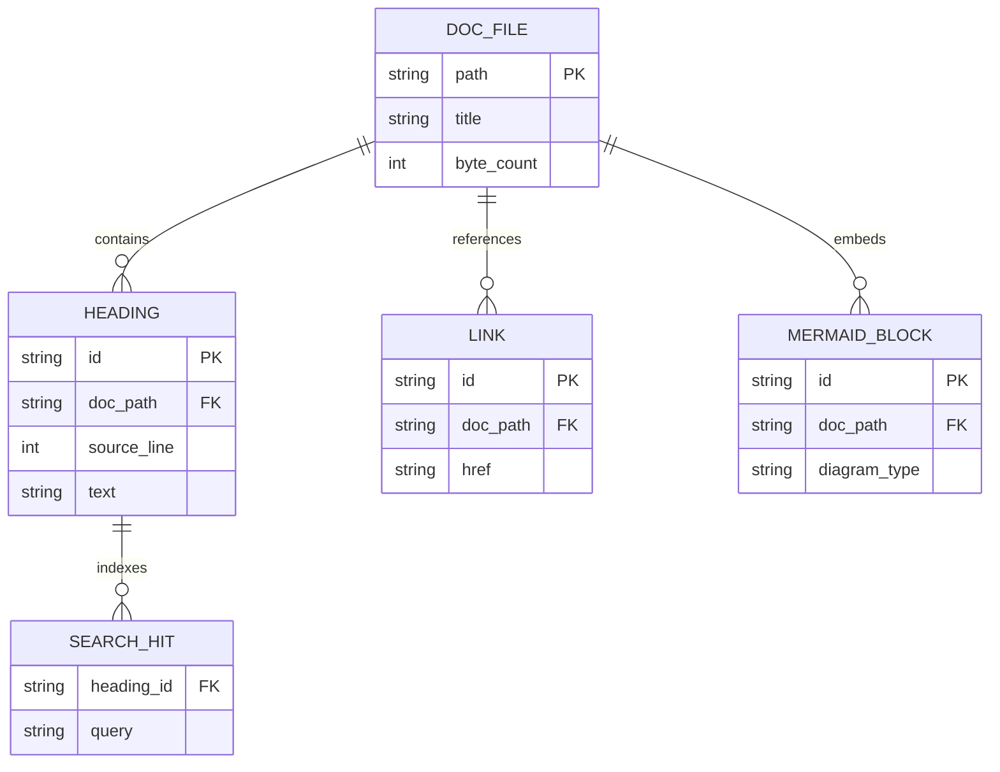
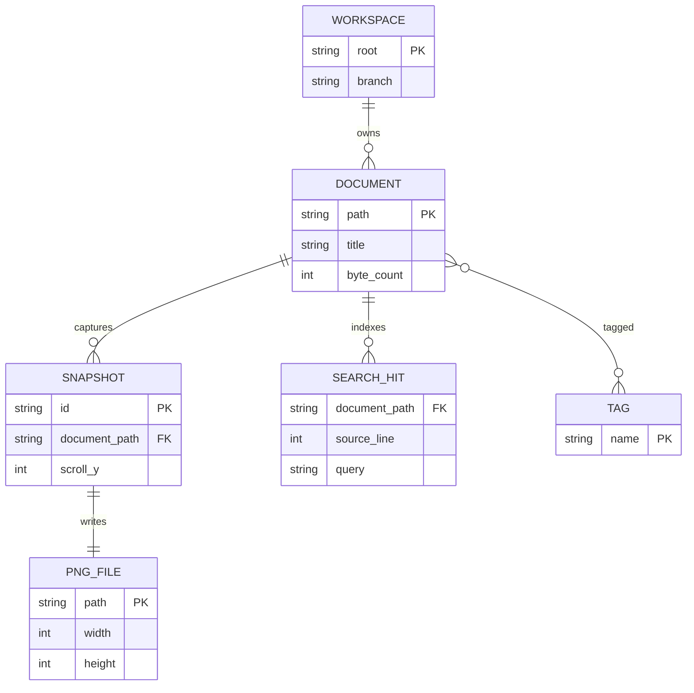
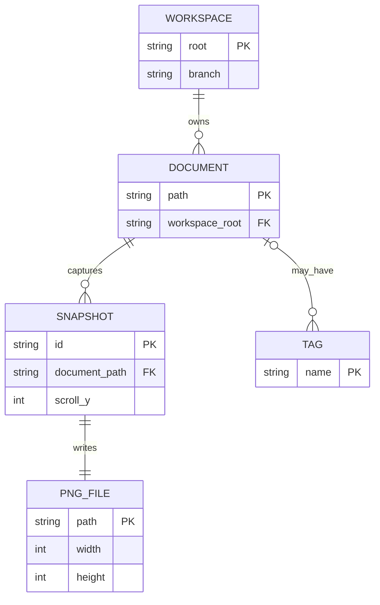

# Mermaid ER Diagrams

DocCrate renders Mermaid `erDiagram` blocks natively. They are useful for
data models, event schemas, persistence boundaries, and domain documentation.

## Manual ER Layout

Manual comments can place entities and route relationships when an ER diagram
needs a stable documentation-friendly shape. Use `@node` for entities,
`@edge` for relationship paths and labels, and `@graph` for the canvas.

Cardinality and optional relationships are drawn with crow's foot markers:

