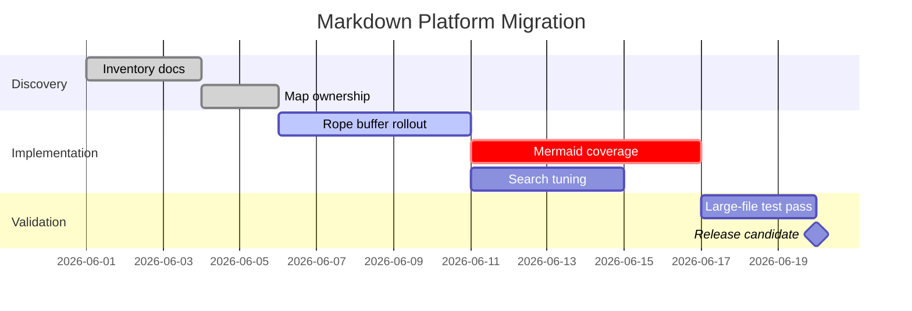

# Mermaid Gantt Charts

DocCrate renders Mermaid `gantt` blocks natively. They are useful for release
plans, migration windows, incident remediation, and dependency-heavy workflow
docs.

```mermaid
gantt
title DocCrate Mermaid Rendering Plan
dateFormat YYYY-MM-DD
section Parser
Gantt grammar wired :done, p1, 2026-05-25, 2d
Native IR :done, p2, after p1, 2d
section Renderer
Bars and axis :active, r1, after p2, 3d
Snapshot review :crit, r2, after r1, 2d
section Release
Ship Gantt support :milestone, ship, after r2, 0d
```

A longer migration view with multiple sections:


