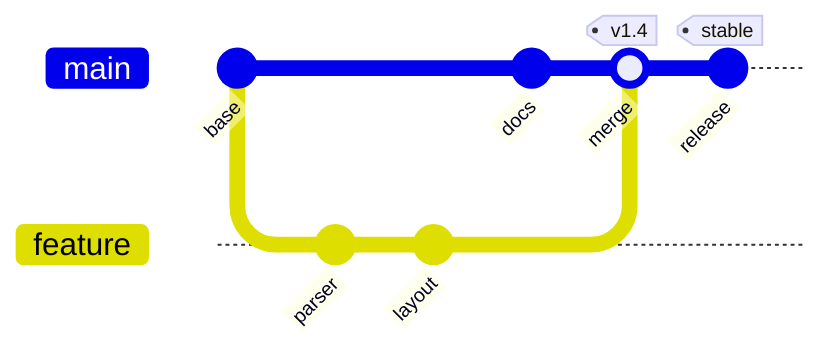
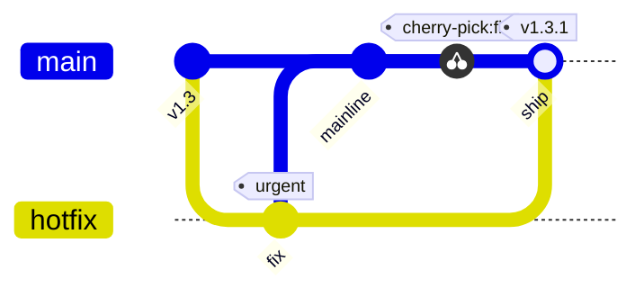

# Mermaid Git Graphs

DocCrate renders Mermaid `gitGraph` blocks natively. They are useful for
release strategy, branching policy, hotfix flow, and migration history.

A hotfix flow with a cherry-pick:

