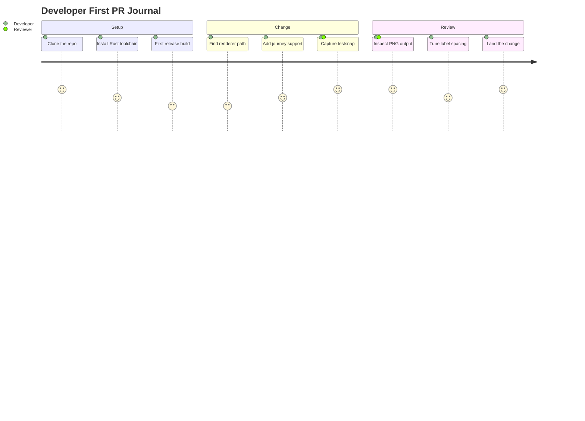
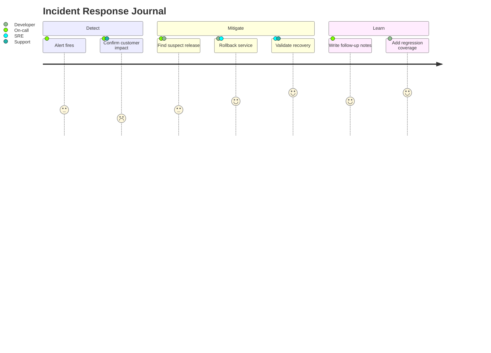
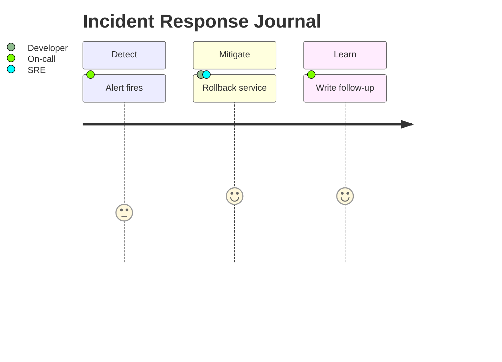

# Mermaid Journeys

DocCrate renders Mermaid `journey` blocks natively. They are useful for
software workflow journals, onboarding notes, release days, and incident
response retrospectives where the important signal is the experience of each
step.

An incident response journey:

## Manual Journey Layout

Manual comments can place journey cards, section headers, and the canvas when
the journal needs a presentation-quality shape. Use `@node` for task cards,
`@group` for section headers, and `@graph` for the canvas.

