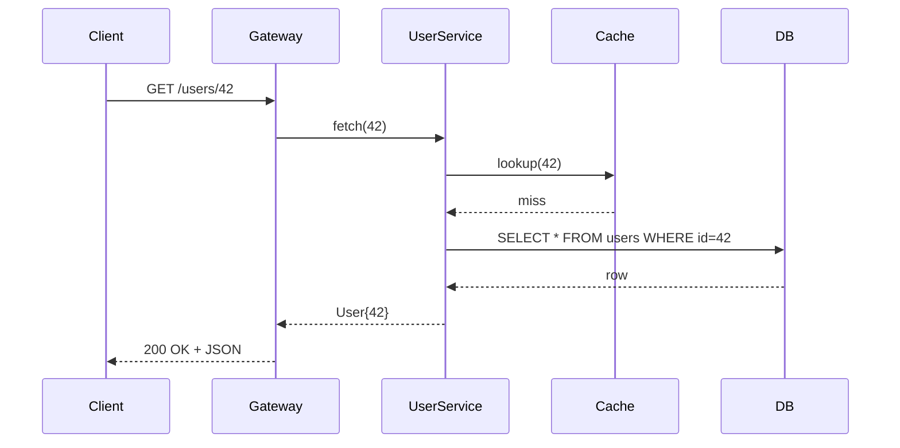
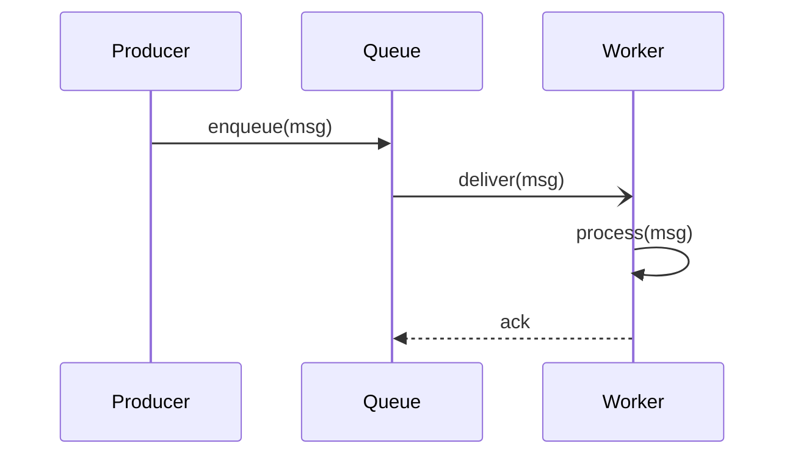
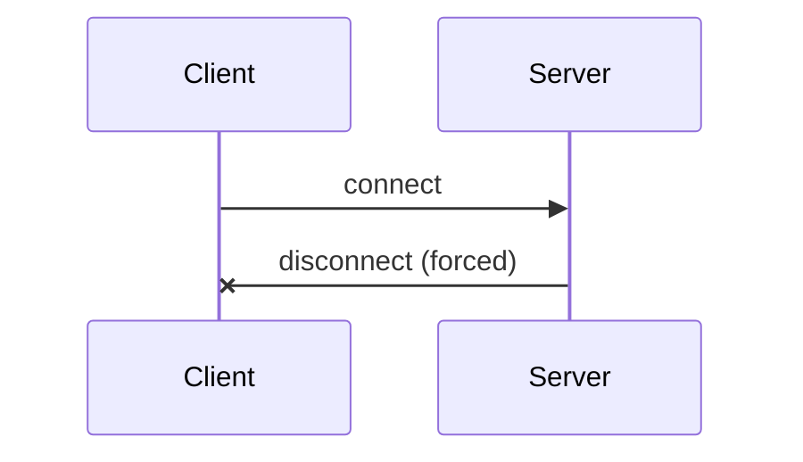
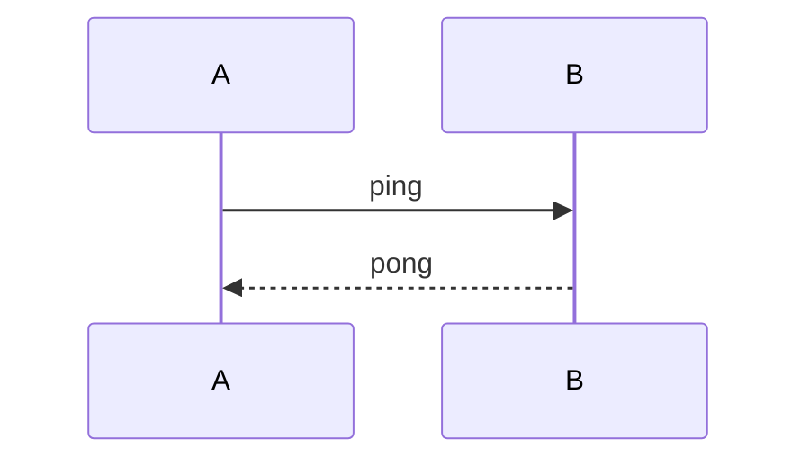
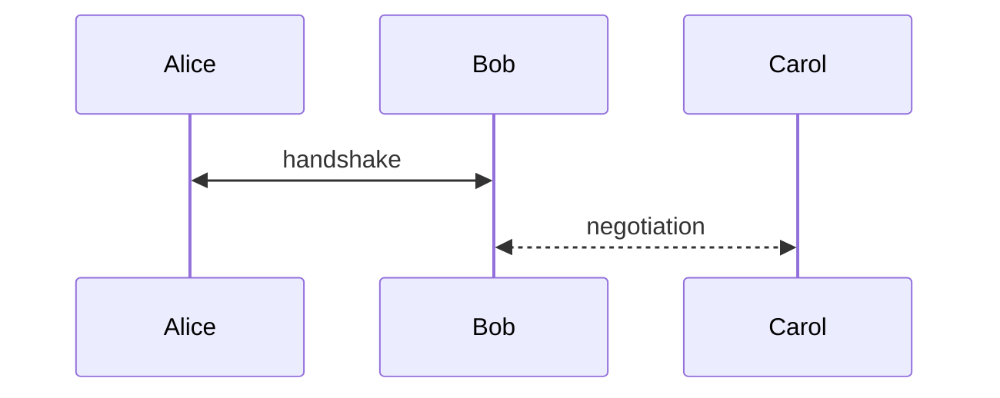

# Sequence Diagrams

Phase 1 — actors with lifelines and time-ordered messages. Activation boxes,
notes, and fragments (loop / alt / opt / par) come in a follow-up.

A small request/response chain with a couple of return arrows:

Open arrowheads (async / fire-and-forget — use `-)` not `->)`) and a
self-message:

Cross-mark for destroyed / lost messages (`-x` solid, `--x` dotted):

A short ping/pong:

Bidirectional (arrowheads on both ends — `<<->>` solid, `<<-->>` dotted):

## Arrow Reference

The full set of arrow tokens supported by the sequence parser. Anything else
will surface a parse error rather than render incorrect geometry.

| Token  | Line   | Arrowhead       | Use                              |
|:------:|:------:|:----------------|:---------------------------------|
| `->`   | solid  | none            | bare line, no head               |
| `-->`  | dotted | none            | bare dotted line                 |
| `->>`  | solid  | filled triangle | synchronous request              |
| `-->>` | dotted | filled triangle | response / return value          |
| `-x`   | solid  | cross           | destroyed / lost message         |
| `--x`  | dotted | cross           | dotted lost message              |
| `-)`   | solid  | open `<`        | asynchronous fire-and-forget     |
| `--)`  | dotted | open `<`        | dotted async                     |
| `<<->>`  | solid  | filled, both ends | bidirectional sync             |
| `<<-->>` | dotted | filled, both ends | bidirectional dotted           |

Any token may be suffixed with `+` or `-` to activate/deactivate the target
actor as a single operation (e.g. `Client->>+Server: req`).

If a diagram fails to parse you'll see an italic `mermaid error: ...` line
followed by the source as a code block.
