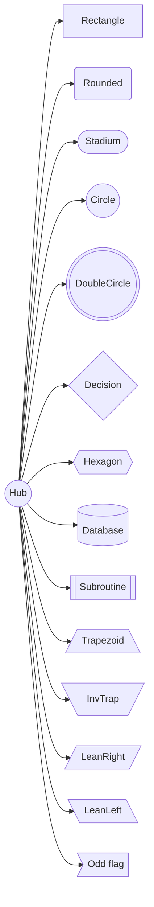
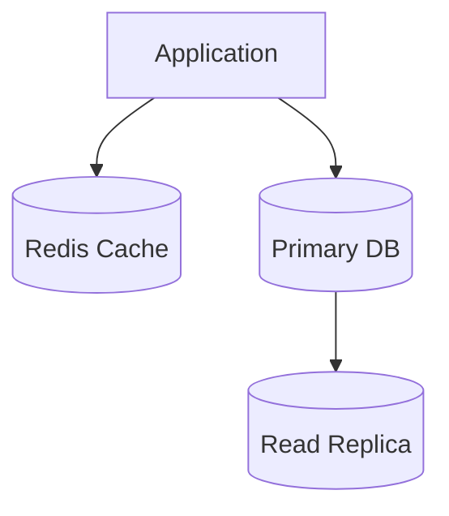

# Mermaid Shapes

Every shape the renderer now supports, in order. Connected to a `Hub` node so
selkie actually keeps them in the layout — orphan nodes get dropped.

Cylinders with annotations — overriding fill and stroke per-node:

If any shape doesn't render or looks wrong, tell me which name and what you
see.
