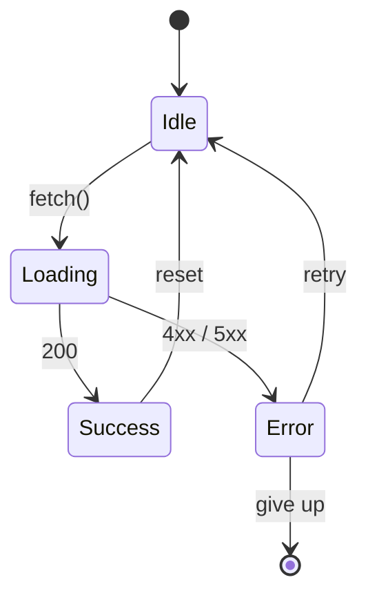
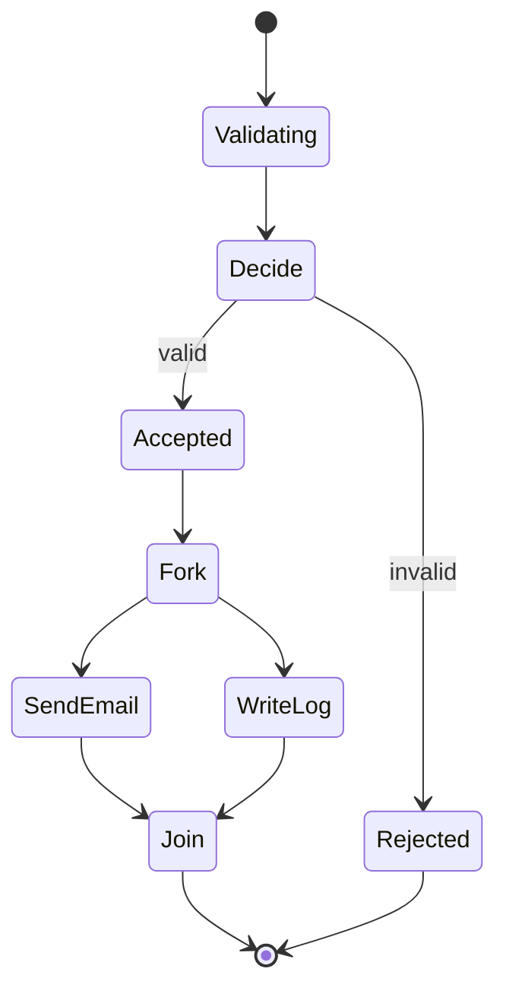
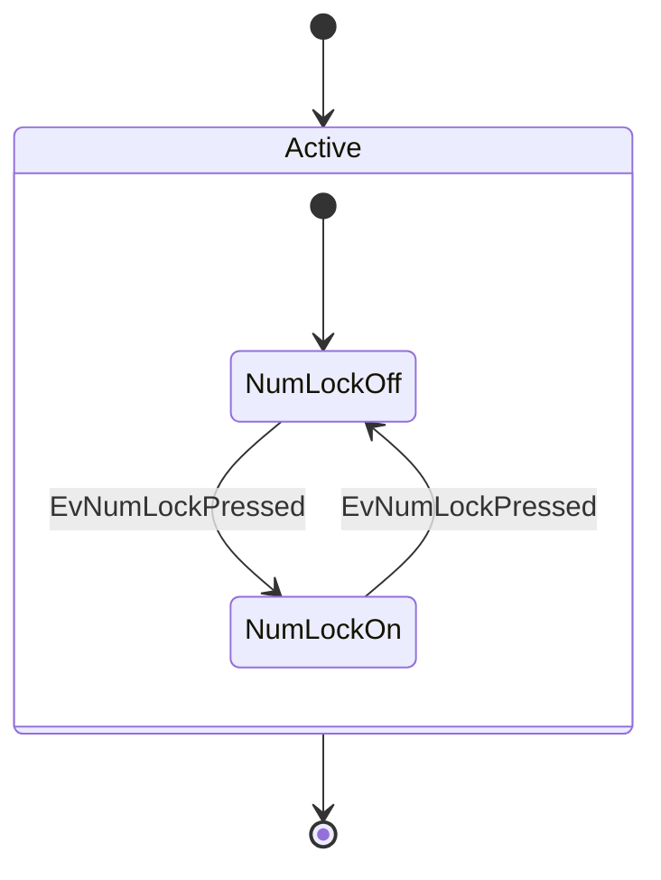

# State Diagrams

DocCrate renders mermaid `stateDiagram-v2` blocks through the same renderer
as flowcharts. Selkie maps each state type to the appropriate shape (Start
→ filled circle, End → double circle, Choice → diamond, Fork/Join →
horizontal bar, Default → rounded rect), so everything you've seen in the
flowchart catalog applies here too.

## A simple lifecycle

## Choice + fork / join

## Composite states

A `state Name { ... }` block becomes a group with nested children — the
renderer paints the bounding box first and the children on top.

State diagrams don't yet honour `@annotation` overrides (selkie's
annotation database is flowchart-only at the moment), so they render with
DocCrate's theme defaults.
