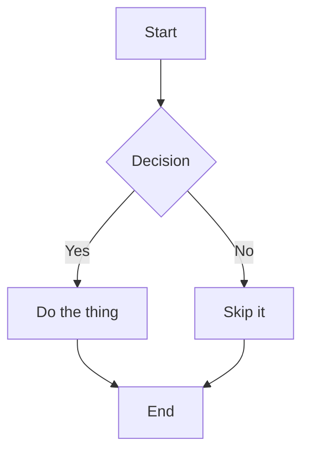
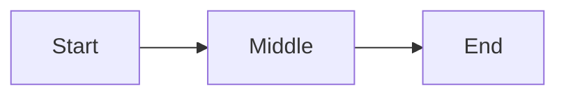
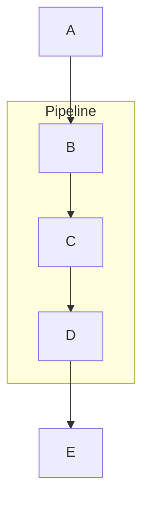

# Mermaid Test

Simple flowchart to verify the rendering pipeline.

Same diagram with a couple of annotations to exercise the override path:

A diagram inside a subgraph:

If the build is bad you'll see an italic error line and the source as a code block instead.
