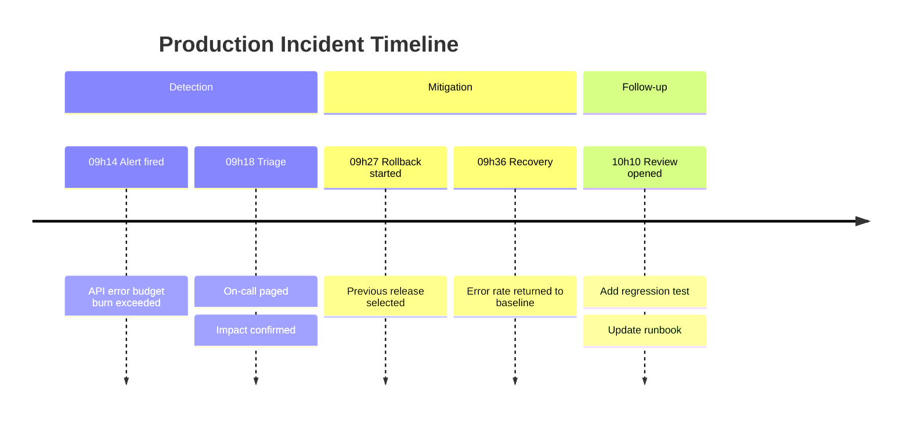
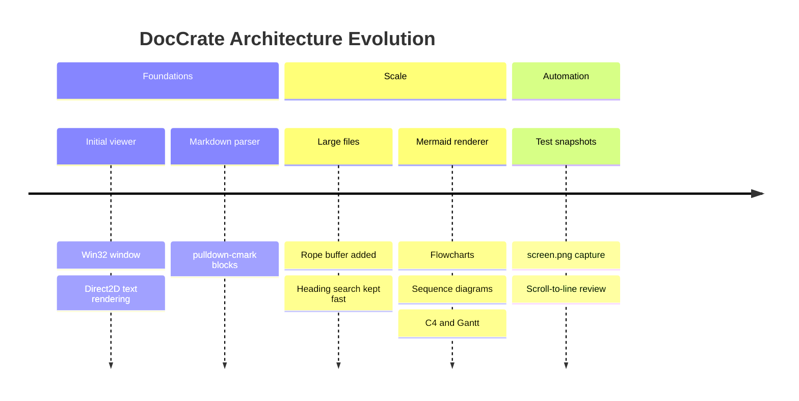
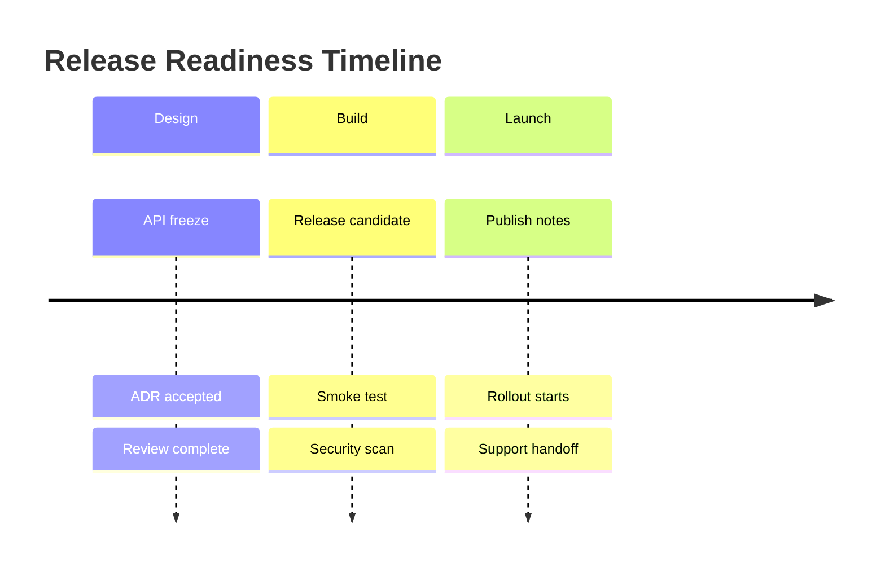

# Mermaid Timelines

DocCrate renders Mermaid `timeline` blocks natively. They are useful for
incident reports, release history, architecture evolution, and decision logs.

A system evolution timeline:

## Manual Timeline Layout

Manual comments can place timeline tasks, event boxes, section bands, and the
canvas when an incident report or release log needs stable spacing. Use
`@node` for task and event boxes, `@group` for sections, and `@graph` for the
canvas.

